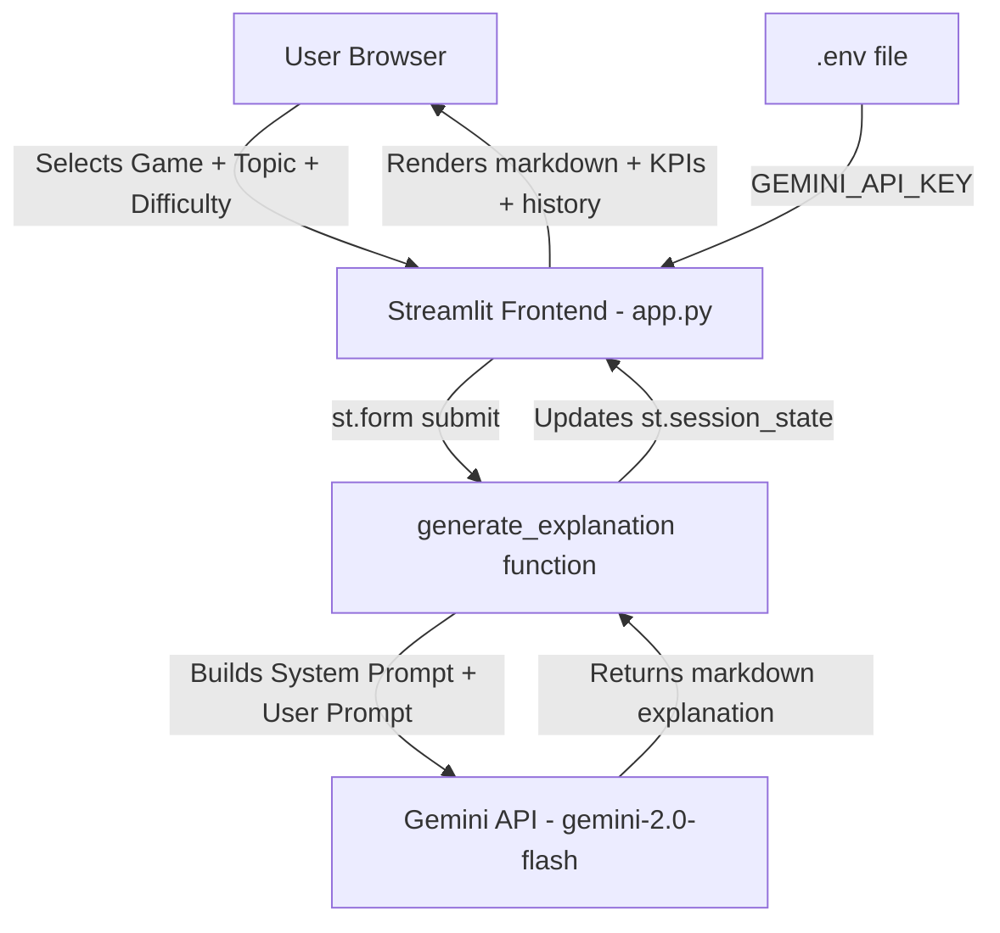

# System Architecture — Explain it Like I Play

## 1. Overview
A single-page Streamlit app that takes a **game** + a **technical topic** from
the user, builds a system-prompt around them, and sends the request to
**Google Gemini** to generate a game-themed explanation.

## 2. Architecture Diagram

## 3. Data Flow
1. **Input:** User picks a game (Minecraft/Mario/Valorant/Chess), a topic
   (preset or custom), and a difficulty level (1–4) inside an `st.form`.
2. **Prompt Construction:** On submit, `generate_explanation()` builds a
   system instruction that forces Gemini to only use analogies from the
   chosen game, plus a difficulty-specific instruction.
3. **API Call:** A single request is sent to the Gemini API
   (`google-generativeai` SDK) using the `gemini-2.0-flash` model.
4. **State Update:** The result is stored in `st.session_state.history` so
   it survives Streamlit's rerun-on-every-interaction behavior, and the KPI
   counters update.
5. **Output:** The explanation is rendered as markdown; the sidebar shows
   session stats and a browsable history table (`st.data_editor`).

## 4. API Integration Strategy
- **Provider:** Google Gemini (`google-generativeai` Python SDK).
- **Auth:** API key loaded from `.env` via `python-dotenv`, never hardcoded.
- **Single call per submit:** Wrapping inputs in `st.form` ensures the API is
  called only once per "Generate" click, not on every widget interaction —
  this keeps API usage efficient and cost-low.
- **Error handling:** API failures are caught and shown as a friendly
  `st.error` message instead of crashing the app.

## 5. Logic Modules (all inside `app.py` for simplicity)
| Module | Responsibility |
|---|---|
| Setup & Config | Loads `.env`, configures Gemini, sets page config |
| Session State | Initializes `history`, `total_explanations`, `last_game` |
| Static Data | Game list, emojis, preset topics, difficulty map |
| `generate_explanation()` | Builds prompt, calls Gemini, returns text |
| Sidebar UI | KPI cards (`st.metric`) + history (`st.data_editor`) |
| Main Form UI | Game/topic/difficulty selection (`st.form`) |
| Submission Handler | Validates input, calls API, updates state, renders output |

## 6. Deployment
Deployed on **Streamlit Community Cloud**, pointing at `app.py`, with
`GEMINI_API_KEY` set as a Secret (not committed to GitHub).
