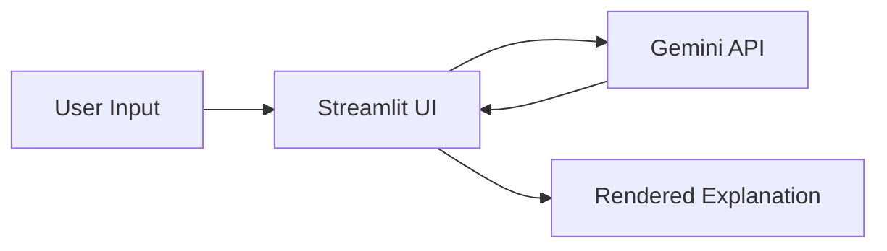

# 🎮 Explain it Like I Play

```
$ whoami
> An AI dictionary that explains hard engineering concepts
> using ONLY the game you already love playing.

$ echo "Recursion, but make it Minecraft"
> "It's like crafting a crafting table to craft a crafting table..."
```

<p align="center">
  
  
  
</p>

---

## `> about`

**Explain it Like I Play** takes a complex engineering or CS topic (like
*Recursion*, *Load Balancing*, or *TCP/IP Handshakes*) and re-explains it
**entirely through the mechanics of a video game you already understand** —
Minecraft, Mario, Valorant, or Chess.

No generic textbook definitions. Every explanation is a concrete, mapped
analogy: your game's items, characters, and rules become the technical
concept.

---

## `> demo`

🔗 **Live App:** https://explain-it-like-i-play.streamlit.app/

---

## `> features`

```
[✔] Pick from 4 games: Minecraft, Mario, Valorant, Chess
[✔] 8 preset CS topics + custom topic input
[✔] 4 difficulty levels (Beginner -> Interview-level)
[✔] Session stats via st.metric KPI cards
[✔] Browsable explanation history via st.data_editor
[✔] Zero memory loss between reruns (st.session_state)
[✔] Single API call per request (st.form)
```

---

## `> architecture`

See [`ARCHITECTURE.md`](./ARCHITECTURE.md) for the full system diagram and
data flow.



## `> tech_stack`

| Layer | Tool |
|---|---|
| Frontend / UI | Streamlit |
| AI Engine | Google Gemini API (`gemini-3.6-flash`) |
| Env Management | `python-dotenv` |
| Package Manager | `uv` (or pip) |
| Language | Python 3.10+ |

---

## `> project_structure`

```
explain-it-like-i-play/
├── app.py                # Main Streamlit application
├── requirements.txt      # Python dependencies
├── .env.example           # Template for API key (safe to commit)
├── .env                    # Your real API key (NEVER commit this)
├── .gitignore
├── ARCHITECTURE.md        # System design + Mermaid diagram
└── README.md
```

---

## `> author`

Built by **Varad** — B.Tech CS (AIML), as a showcase project.